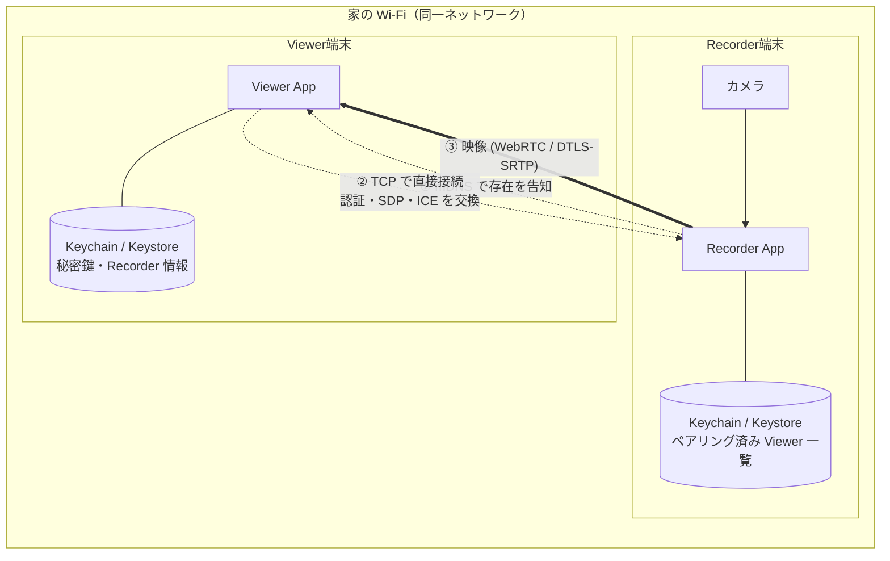
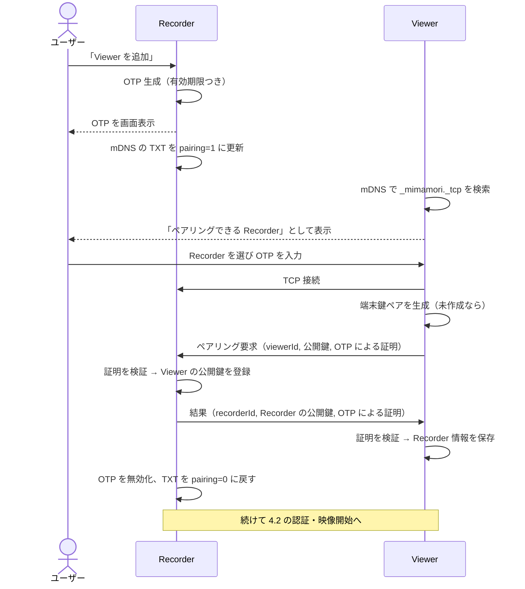
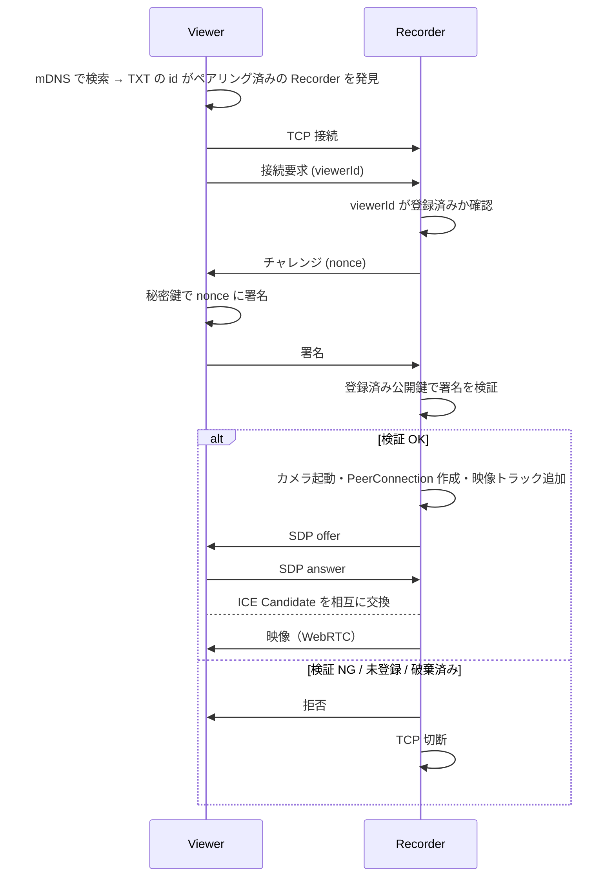
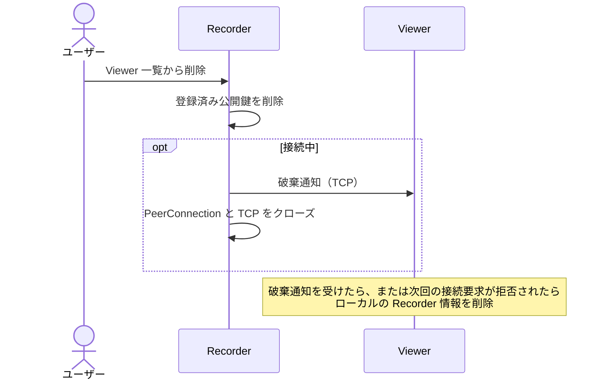

# アーキテクチャ

## 1. 全体構成

**登場するのは Recorder と Viewer の 2 台だけ。サーバーは使わない。**
両端末が同じ Wi-Fi（同一ネットワーク）に繋がっていることを前提とする。



| 手順 | 使う技術 | 役割 |
| --- | --- | --- |
| ① 発見 | mDNS / DNS-SD（Apple の呼び名は Bonjour） | Viewer が Recorder の IP・ポートを自動で知る |
| ② シグナリング | TCP（Recorder が待ち受ける） | 認証メッセージ・SDP・ICE Candidate の交換 |
| ③ 映像 | WebRTC | 暗号化された映像を P2P で送る |

家の外からの接続は対象外のため、STUN / TURN サーバーは使わない。

## 2. WebRTC の基礎

WebRTC を初めて触る前提で、このアプリに必要な概念だけを整理する。

| 用語 | 役割 | Mimamori での使い方 |
| --- | --- | --- |
| **PeerConnection** | 1 対 1 の P2P 接続を表すオブジェクト | Recorder は接続中の Viewer ごとに 1 つ持つ |
| **MediaStreamTrack** | 映像・音声の 1 本のストリーム | Recorder のカメラ映像トラックを PeerConnection に追加する |
| **DataChannel** | P2P 上で任意のデータを送る経路 | v1 では使わない（制御は TCP のシグナリング接続で行う） |
| **SDP** (Session Description Protocol) | 「どんなコーデックで何を送るか」を記述したテキスト | offer / answer として交換する |
| **Offer / Answer** | 接続を提案する側が offer、受ける側が answer を作る | Recorder が offer、Viewer が answer |
| **ICE Candidate** | 「この IP:ポートなら届くかも」という接続経路の候補 | LAN 内の IP（host candidate）だけで繋がる |
| **STUN / TURN** | 外部ネットワーク越しに繋ぐためのサーバー | **使わない**（同一ネットワーク限定のため） |
| **シグナリング** | SDP と ICE Candidate を相手に届ける仕組み | **WebRTC の仕様外**。Mimamori では Recorder が TCP で直接受け付ける |

> ポイント: WebRTC は「P2P で繋がった後」の仕組みは提供してくれるが、「相手を見つけて最初の情報を交換する」部分（発見とシグナリング）は提供しない。ここはアプリ側の設計になる。

`RTCConfiguration` の `iceServers` は空でよい。端末は自分の LAN 内 IP を host candidate として出し、それだけで接続できる。

## 3. コンポーネント

### 3.1 サービス発見（mDNS / DNS-SD）

Recorder は撮影中、同一ネットワーク内に次のサービスを告知する。

| 項目 | 値（案） |
| --- | --- |
| サービスタイプ | `_mimamori._tcp` |
| サービス名 | Recorder の表示名（例: 「子ども部屋」） |
| ポート | OS に自動で割り当ててもらったポート |
| TXT レコード `id` | `recorderId`（ペアリング済みかどうかの判定に使う） |
| TXT レコード `pairing` | `1` = OTP 表示中（ペアリング受付中）、`0` = それ以外 |
| TXT レコード `v` | プロトコルのバージョン（互換性チェック用） |

Viewer は `_mimamori._tcp` を探し、見つかった Recorder を次のように分類して表示する。

- `id` がペアリング済み → 「接続できる Recorder」
- `pairing=1` かつ未ペアリング → 「ペアリングできる Recorder」
- それ以外 → 表示しない

> TXT レコードは同じネットワーク内の誰でも見られる。秘密情報（OTP など）は絶対に入れない。

### 3.2 LAN 内シグナリング

- Recorder が TCP で待ち受け、Viewer が接続する。
- メッセージは **1 行 1 JSON（改行区切り）** とする案。SDP 内の改行は JSON 文字列の `\n` としてエスケープされるので問題ない。
- TCP 接続は視聴中ずっと維持し、破棄の通知や再接続にも使う。TCP が切れたら視聴も終了する。

メッセージの具体的な形式は **M3 で自分で設計する**（[roadmap.md](roadmap.md)）。必要になるメッセージの種類は次のとおり。

| 方向 | 用途 |
| --- | --- |
| Viewer → Recorder | ペアリング要求 / 接続要求 / 署名 / SDP answer / ICE Candidate |
| Recorder → Viewer | ペアリング結果 / チャレンジ / 拒否 / SDP offer / ICE Candidate / 破棄通知 |

### 3.3 Recorder App

- カメラキャプチャ → WebRTC の VideoTrack
- mDNS での告知と TCP での待ち受け
- ペアリング済み Viewer 一覧の管理（追加・破棄）
- Viewer ごとの PeerConnection 管理
- 温度・バッテリー状態の監視と画質調整

### 3.4 Viewer App

- mDNS での Recorder 検索
- ペアリング済み Recorder 一覧の管理
- 端末固有の鍵ペア（秘密鍵は端末外に出さない）
- 映像の受信・表示

### 3.5 プラットフォーム別技術スタック

| | iOS | Android |
| --- | --- | --- |
| 言語 / UI | Swift / SwiftUI | Kotlin / Jetpack Compose |
| WebRTC | Google WebRTC のビルド済みパッケージ（SPM） | `io.getstream:stream-webrtc-android`（導入済み） |
| カメラ | WebRTC の `RTCCameraVideoCapturer`（内部で AVFoundation） | WebRTC の `Camera2Capturer`（内部で Camera2） |
| 発見（mDNS） | Network フレームワークの `NWListener`（告知）/ `NWBrowser`（検索） | `NsdManager` |
| TCP 通信 | `NWListener` / `NWConnection` | `ServerSocket` / `Socket`（Kotlin Coroutines と組み合わせる） |
| 鍵の保管 | Secure Enclave (CryptoKit) + Keychain | Android Keystore |
| 温度監視 | `ProcessInfo.thermalState` | `PowerManager.getCurrentThermalStatus()` / `getThermalHeadroom()` |

> Google は WebRTC のモバイル向けビルド済みバイナリを公式には配布していないため、コミュニティが配布しているパッケージを使う。

#### iOS のローカルネットワーク権限

iOS では LAN 内の通信に **ユーザーの許可** が必要。`Info.plist` に次を記載しないと、発見も通信も失敗する。

- `NSLocalNetworkUsageDescription`: 許可ダイアログに表示する説明文
- `NSBonjourServices`: 使うサービスタイプ（`_mimamori._tcp`）

許可されなかった場合のエラーが分かりにくいので、ハマりどころになる。

## 4. 接続シーケンス

### 4.1 発見とペアリング（初回）



詳細（証明の作り方・脅威モデル）は [security.md](security.md) を参照。

### 4.2 接続（2 回目以降）



- **認証が通るまで PeerConnection を作らず、カメラも起動しない。** セキュリティと省電力の両方を満たす。
- offer は Recorder 側から出す（映像を送る側が構成を決めるのが自然なため）。

### 4.3 破棄



### 4.4 切断と再接続

- Wi-Fi の再接続などで Recorder の IP が変わることがある。Viewer は **IP を保存せず、毎回 mDNS で探し直す**。
- TCP か PeerConnection のどちらかが切れたら、両方を閉じて 4.2 からやり直す。

## 5. データモデル（案）

### Recorder が保持

```
RecorderIdentity
  recorderId: String          // 公開鍵から導出 or UUID
  displayName: String         // mDNS のサービス名に使う
  keyPair: (Secure Enclave / Keystore 内)

PairedViewer
  viewerId: String
  publicKey: Bytes
  displayName: String         // Viewer 端末名
  pairedAt: Date
  lastConnectedAt: Date?
```

### Viewer が保持

```
ViewerIdentity
  viewerId: String
  keyPair: (Secure Enclave / Keystore 内)

PairedRecorder
  recorderId: String          // mDNS の TXT id と照合する
  publicKey: Bytes
  displayName: String
  pairedAt: Date
```

## 6. 同一ネットワーク限定であることの利点と制約

| 利点 | 制約 |
| --- | --- |
| サーバー不要（費用・運用ゼロ） | 家の外からは見られない |
| 映像が家の外に出ない | AP アイソレーション・ゲスト Wi-Fi では繋がらない |
| STUN / TURN が不要で接続が単純・高速 | iOS のローカルネットワーク許可が必要 |
| 遅延が小さい | シグナリング経路（TCP）は暗号化されていない（[security.md](security.md) 参照） |

## 7. 省電力・発熱対策

Recorder の電力消費の大部分は **カメラ・映像エンコード・無線通信・画面** の 4 つ。それぞれに対策を入れる。

### 7.1 視聴者がいないときは何もしない

- Viewer が 1 台も接続していないときは **カメラを止め、エンコードもしない**。
- 待機中は mDNS の告知と TCP の待ち受けだけを行う（どちらも軽量）。
- 接続時のカメラ起動に 1 秒前後かかるが、見守り用途では許容する。

### 7.2 控えめなデフォルト画質

| パラメータ | デフォルト案 | 備考 |
| --- | --- | --- |
| 解像度 | 1280x720 | 見守りには十分 |
| フレームレート | 15 fps | 30 fps の約半分の負荷 |
| 最大ビットレート | 1 Mbps 程度 | `RtpSender` のパラメータで上限を設定。LAN 内なので帯域より発熱を優先して決める |
| コーデック | H.264（ハードウェアエンコーダ優先） | iOS / Android ともにハードウェア支援があり省電力 |

- 回線状況が悪いときの劣化方針（`degradationPreference`）は、見守り用途では **解像度維持 (maintain-resolution)** が候補。

### 7.3 温度に応じた段階的な画質調整

| 温度状態 | iOS `thermalState` | Android `THERMAL_STATUS_*` | 対応 |
| --- | --- | --- | --- |
| 通常 | `.nominal` / `.fair` | `NONE` / `LIGHT` | デフォルト画質 |
| 高め | `.serious` | `MODERATE` / `SEVERE` | 解像度・fps を下げる（例: 640x360 / 10fps） |
| 危険 | `.critical` | `CRITICAL` 以上 | 配信を一時停止し、Viewer に通知 |

### 7.4 同時視聴数

P2P では **Viewer ごとに別々にエンコードして送る** ため、Viewer が 2 台なら負荷もほぼ 2 倍になる。v1 は同時視聴を 1 台に制限することを想定。

### 7.5 画面とバックグラウンド

- **iOS はアプリがバックグラウンドになるとカメラを使えない。** Recorder はフォアグラウンドのまま動かす必要がある。
  - 撮影中は画面スリープを無効化しつつ、画面を真っ黒（または最低輝度）にする「省電力表示モード」を用意する。
- Android は Foreground Service（`foregroundServiceType="camera"`）を使えば画面オフでも撮影を継続できる。TCP の待ち受けと mDNS の告知もこの Service の中で動かす。

### 7.6 その他

- 充電しながらの運用を前提とし、未充電時はアプリ内で案内する。
- 端末ケースを外す・直射日光を避けるなど、物理的な発熱対策もヘルプに記載する。
