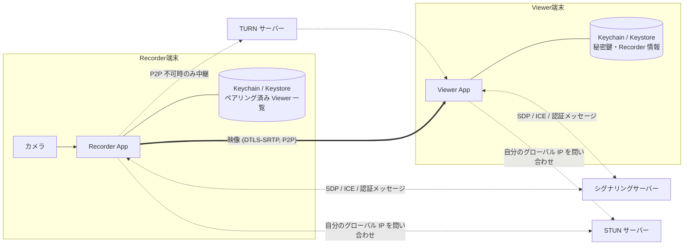
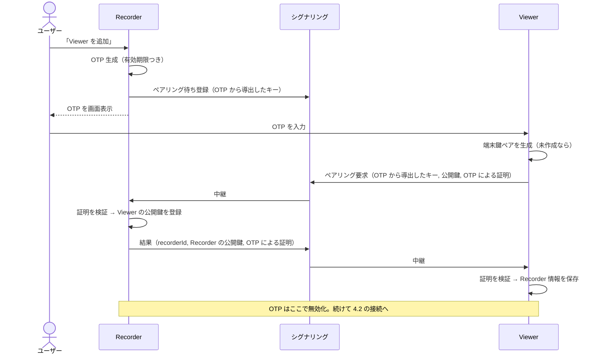
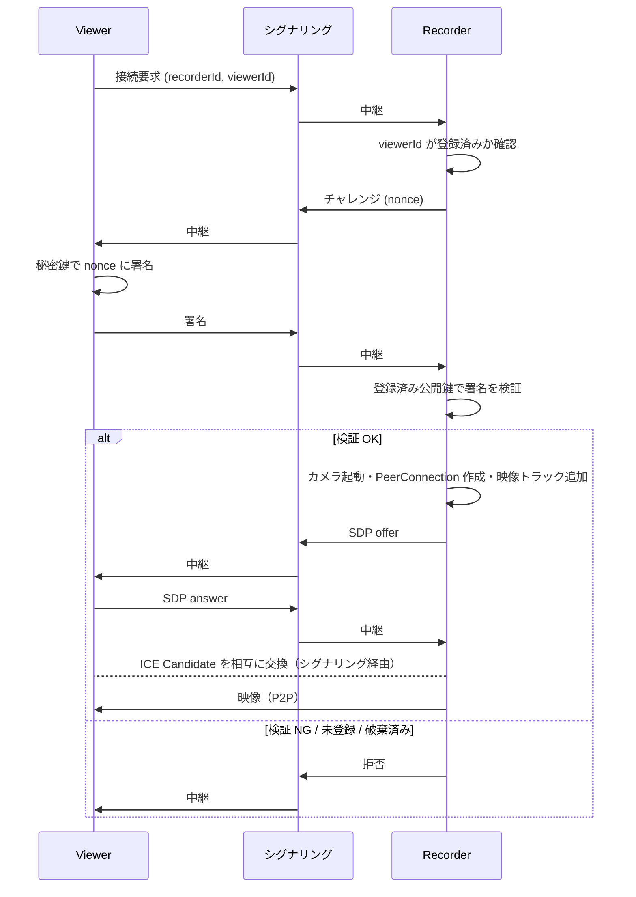
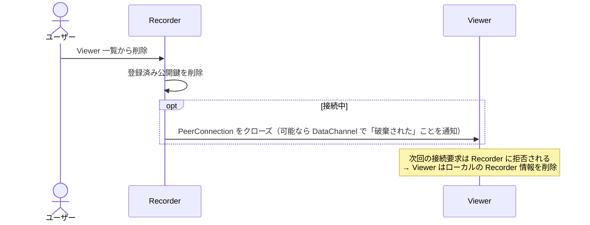

# アーキテクチャ

## 1. 全体構成



- **映像は端末間で直接（P2P）流れる。** サーバーは「接続を始めるための情報交換」にだけ使う。
- P2P で繋がらないネットワーク（対称型 NAT など）の場合のみ、TURN サーバーが映像を中継する。中継時も映像は暗号化されたままで、TURN サーバーは中身を見られない。

## 2. WebRTC の基礎

WebRTC を初めて触る前提で、このアプリに必要な概念だけを整理する。

| 用語 | 役割 | Mimamori での使い方 |
| --- | --- | --- |
| **PeerConnection** | 1 対 1 の P2P 接続を表すオブジェクト | Recorder は接続中の Viewer ごとに 1 つ持つ |
| **MediaStreamTrack** | 映像・音声の 1 本のストリーム | Recorder のカメラ映像トラックを PeerConnection に追加する |
| **DataChannel** | P2P 上で任意のデータを送る経路 | 制御メッセージ（カメラ切替要求など）に利用予定 |
| **SDP** (Session Description Protocol) | 「どんなコーデックで何を送るか」を記述したテキスト | offer / answer として交換する |
| **Offer / Answer** | 接続を提案する側が offer、受ける側が answer を作る | Recorder が offer、Viewer が answer（下記シーケンス参照） |
| **ICE Candidate** | 「この IP:ポートなら届くかも」という接続経路の候補 | 両端末が見つけた候補をシグナリング経由で交換する |
| **STUN** | 自分の外から見た IP:ポートを教えてくれるサーバー | 公開 STUN サーバーを利用可能 |
| **TURN** | P2P できないときに通信を中継するサーバー | 要用意（[未決事項](product.md#6-未決事項)） |
| **シグナリング** | SDP と ICE Candidate を相手に届ける仕組み | **WebRTC の仕様外**。自分で用意する必要がある |

> ポイント: WebRTC は「P2P で繋がった後」の仕組みは提供してくれるが、「相手を見つけて最初の情報を交換する」部分（シグナリング）は提供しない。ここはアプリ側の設計になる。

## 3. コンポーネント

### 3.1 シグナリングサーバー

役割:

- Recorder のオンライン状態の管理（Recorder は撮影中、サーバーに接続して待ち受ける）
- Recorder ⇄ Viewer 間のメッセージ中継（SDP / ICE Candidate / 認証メッセージ）
- ペアリング時の OTP による Recorder の検索と、総当たり対策のレート制限

サーバーは **映像を扱わず、認可の最終判断もしない**（認可は Recorder が行う。[security.md](security.md) 参照）。

実装方式の候補:

| 方式 | メリット | デメリット |
| --- | --- | --- |
| Firebase (Firestore / Realtime Database) | サーバー運用不要。iOS/Android SDK が揃っている | レート制限など細かい制御は Cloud Functions / Security Rules で工夫が必要 |
| 自前 WebSocket サーバー (Node.js / Go / Kotlin など) | 仕組みを理解しやすい。制御の自由度が高い | ホスティング・運用が必要 |

学習目的では、まず **ローカルで動く簡易 WebSocket サーバー** で仕組みを理解し、必要に応じて置き換えるのがおすすめ。

### 3.2 Recorder App

- カメラキャプチャ → WebRTC の VideoTrack
- シグナリングサーバーへの常時接続（待ち受け）
- ペアリング済み Viewer 一覧の管理（追加・破棄）
- Viewer ごとの PeerConnection 管理
- 温度・バッテリー状態の監視と画質調整

### 3.3 Viewer App

- ペアリング済み Recorder 一覧の管理
- 端末固有の鍵ペア（秘密鍵は端末外に出さない）
- 映像の受信・表示

### 3.4 プラットフォーム別技術スタック（案）

| | iOS | Android |
| --- | --- | --- |
| 言語 / UI | Swift / SwiftUI | Kotlin / Jetpack Compose |
| WebRTC | Google WebRTC のビルド済みパッケージ（SPM で導入できるもの） | Google WebRTC のビルド済みパッケージ（Maven で導入できるもの） |
| カメラ | WebRTC の `RTCCameraVideoCapturer`（内部で AVFoundation） | WebRTC の `Camera2Capturer`（内部で Camera2） |
| 鍵の保管 | Secure Enclave (CryptoKit) + Keychain | Android Keystore |
| 温度監視 | `ProcessInfo.thermalState` | `PowerManager.getCurrentThermalStatus()` / `getThermalHeadroom()` |

> Google は WebRTC のモバイル向けビルド済みバイナリを公式には配布していないため、コミュニティが配布しているパッケージを選ぶ必要がある。導入時にメンテ状況を確認して決める。

## 4. 接続シーケンス

### 4.1 ペアリング（初回）



詳細（証明の作り方・脅威モデル）は [security.md](security.md) を参照。

### 4.2 接続（2 回目以降）



- **認証が通るまで PeerConnection を作らない。** 未認証の相手に対してカメラを起動しないことで、セキュリティと省電力の両方を満たす。
- offer は Recorder 側から出す（映像を送る側が構成を決めるのが自然なため）。

### 4.3 破棄



破棄は Recorder のローカル操作だけで完結する（サーバーに依存しない）。

## 5. データモデル（案）

### Recorder が保持

```
RecorderIdentity
  recorderId: String          // 公開鍵から導出 or UUID
  keyPair: (Secure Enclave / Keystore 内)

PairedViewer
  viewerId: String
  publicKey: Bytes
  displayName: String         // Viewer 端末名
  pairedAt: Date
  lastConnectedAt: Date?
```

### Viewer が保持

```
ViewerIdentity
  viewerId: String
  keyPair: (Secure Enclave / Keystore 内)

PairedRecorder
  recorderId: String
  publicKey: Bytes
  displayName: String
  pairedAt: Date
```

## 6. 省電力・発熱対策

Recorder の電力消費の大部分は **カメラ・映像エンコード・無線通信・画面** の 4 つ。それぞれに対策を入れる。

### 6.1 視聴者がいないときは何もしない

- Viewer が 1 台も接続していないときは **カメラを止め、エンコードもしない**。
- 待機中はシグナリングサーバーとの軽量な接続だけを維持する。
- 接続時のカメラ起動に 1 秒前後かかるが、見守り用途では許容する。

### 6.2 控えめなデフォルト画質

| パラメータ | デフォルト案 | 備考 |
| --- | --- | --- |
| 解像度 | 1280x720 | 見守りには十分 |
| フレームレート | 15 fps | 30 fps の約半分の負荷 |
| 最大ビットレート | 1 Mbps 程度 | `RTCRtpSender` のパラメータで上限を設定 |
| コーデック | H.264（ハードウェアエンコーダ優先） | iOS / Android ともにハードウェア支援があり省電力 |

- 回線状況が悪いときの劣化方針（`degradationPreference`）は「フレームレートを維持して解像度を落とす」か「解像度を維持してフレームレートを落とす」かを選べる。見守り用途では **解像度維持 (maintain-resolution)** が候補。

### 6.3 温度に応じた段階的な画質調整

| 温度状態 | iOS `thermalState` | Android `THERMAL_STATUS_*` | 対応 |
| --- | --- | --- | --- |
| 通常 | `.nominal` / `.fair` | `NONE` / `LIGHT` | デフォルト画質 |
| 高め | `.serious` | `MODERATE` / `SEVERE` | 解像度・fps を下げる（例: 640x360 / 10fps） |
| 危険 | `.critical` | `CRITICAL` 以上 | 配信を一時停止し、Viewer に通知 |

### 6.4 同時視聴数

P2P では **Viewer ごとに別々にエンコードして送る** ため、Viewer が 2 台なら負荷もほぼ 2 倍になる。v1 は同時視聴を 1 台に制限することを想定。

### 6.5 画面

- **iOS はアプリがバックグラウンドになるとカメラを使えない。** Recorder はフォアグラウンドのまま動かす必要がある。
  - 撮影中は画面スリープを無効化しつつ、画面を真っ黒（または最低輝度）にする「省電力表示モード」を用意する。
- Android は Foreground Service（`foregroundServiceType="camera"`）を使えば画面オフでも撮影を継続できる。ただし OS バージョンごとの制約に注意。

### 6.6 その他

- 充電しながらの運用を前提とし、未充電時はアプリ内で案内する。
- 端末ケースを外す・直射日光を避けるなど、物理的な発熱対策もヘルプに記載する。
